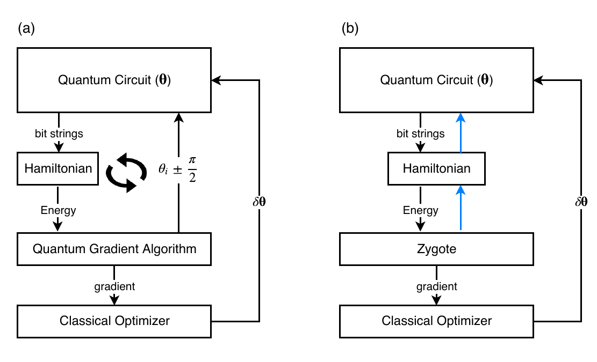
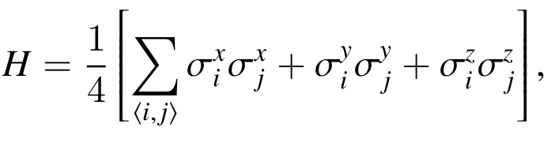
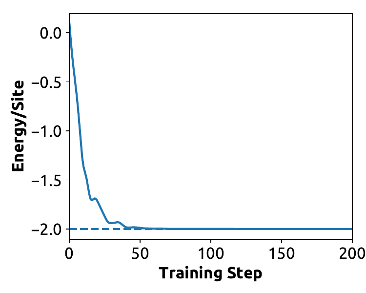

# Variational Quantum Eigensolver

This folder contains a **proof of concept** demonstration of the classical simulation of variational quantum eigensolver algorithm with [PartialP](https://github.com/staticfloat/PartialP.jl) enhanced quantum circuit simulator [Yao.jl](https://github.com/QuantumBFS/Yao.jl).

## Related Work

[1] J. Preskill, [arXiv:1801.00862](http://arxiv.org/abs/arXiv:1801.00862).

[2] A. Peruzzo, J. McClean, P. Shadbolt, M.-H. Yung, X.-Q. Zhou, P. J. Love, A. Aspuru-Guzik, and J. L. O’brien, [Nat. Commun. 5, 4213](https://www.nature.com/articles/ncomms5213) (2014).

[3] J.-G. Liu, Y.-H. Zhang, Y. Wan, and L. Wang, [arXiv:1902.02663](http://arxiv.org/abs/arXiv:1902.02663).

[4] K. Mitarai, M. Negoro, M. Kitagawa, and K. Fujii, [Phys. Rev. A 98, 032309](http://dx.doi.org/10.1103/PhysRevA.98.032309) (2018).

[5] J.-G. Liu and L. Wang, [Phys. Rev. A 98, 062324](http://dx.doi.org/10.1103/PhysRevA.98.062324) (2018).

[6] Yao paper


## Introduction

Studying ground state properties of quantum many-body systems is a promising native application of quantum computers. Given limited qubit resources and noisy realizations of near-term quantum devices [1], a practical approach is to employ the variational quantum eigensolver (VQE) [2, 3]. Recent progress on unbiased gradient estimation on quantum circuits [4, 5] breaks the information bottleneck between classical and quantum processors, thus providing a route towards scalable optimization of circuits with a large number of parameters.

The VQE algorithm can be summarized as the following diagram



FIG. 1. A schetch of VQE algorithm, boxes are objectives and lines indicates data flow. (a) the quantum algorithm, (b) the classical simulation approach with PartialP, where the blue is the backward pass, which is done silently.

In this scheme, a parameterized quantum circuit provides a variational ansatz for the ground state. A classical optimizer tunes the circuit parameters to reduce the expected energy of the target Hamiltonian of the output quantum state. 

In this demo, the target Hamiltonian is an anti-ferromagnetic model



The classical optimizaer `Adam` is from `Flux.jl`, with 200 steps o training, the energy of a 4 site toy model is very close to the exact ground state energy.



Quantum simulator [Yao](https://quantumbfs.github.io/Yao.jl/latest/) [6] used here is introduces in another folder `variational_quantum_circuit`.

## Run the script

All the dependencies are recorded in `Project.toml` and `Manifest.toml`, try the above example by typing

```
julia --project variational_quantum_eigensolver.jl
```
